### Github repository : ecf_elastic_log.

# Activité Type 3 : Supervision des services déployés

Included tasks :
1. Mettez en place un ElasticSearch et connectez-le au Kubernetes.
2. Mettez en place un kibana et connectez-le au élasticsearch. Montrez des exemples de recherches sur les logs (kibana queries).

## Introduction :
<p>Works only when our AWS EKS Kubernetes cluster is up (see how : https://github.com/themaire/ecf_eks_terraform/).</p>
<p>In DevOps practice, monitoring our infrastructure health is critical. For that, the couple of tools ElasticSearch (database) and Kibana (dashbord) will help us a lot to keep a eye on our Kubernetes cluster and a demo NodeJS app (for exemple) via various metrics and logs.</p>

### What I done :

## TASK 1-2 : Monitior a Kubernetes Cluster with ElasticSearch and Kibana

I created a account on https://cloud.elastic.co (paid service but 14 days trial account). Then, i created a "deployment", it is a kind of server.<br>
My "ECF_STUDI" deployment is ready to store and serve datas.
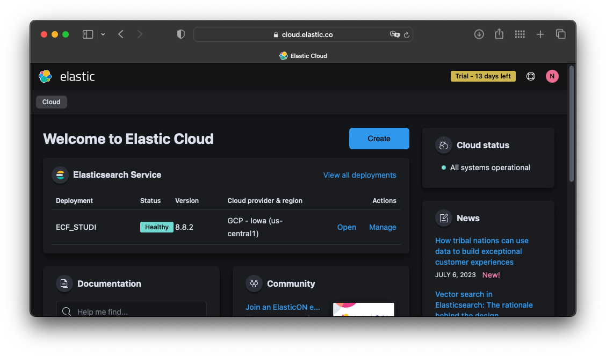

Once entered in the deployment, i spotted a invitation to monitor a Kubernetes Server. Lucky i am, great help given here.
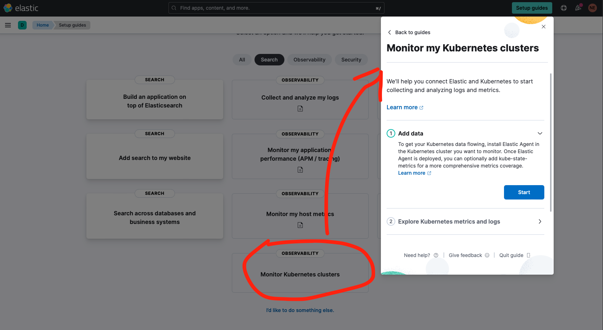

The first thing to do is to install the Kubernetes integration (plugin) on our ElasticSearch server.
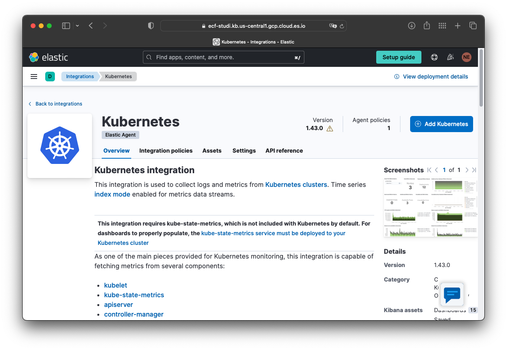

My Kubernetes cluster is operate and hosted by AWS, so i am able to apply the yaml format manifest file provided. <br>

It will deploy a POD who will send lot of cluster's logs. This is the <b>Elastic agent</b>.
<br><br>


Once deployed with the "kubectl apply -f ..." command, the page confirmed that Elastic agent is enrolled to ElasticSearch with success.

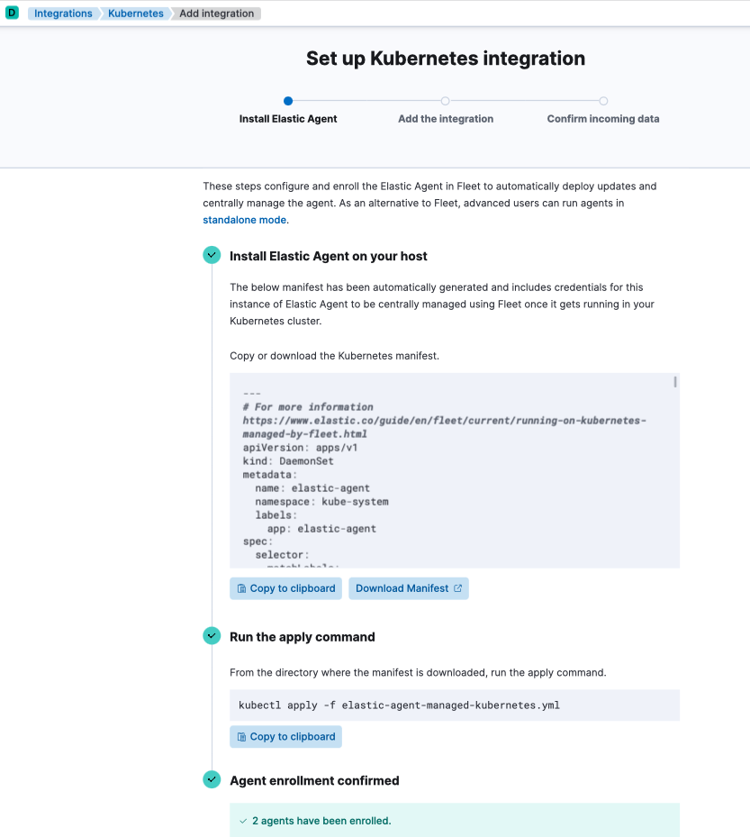


On the next page, we can choose witch data we want to be collected.
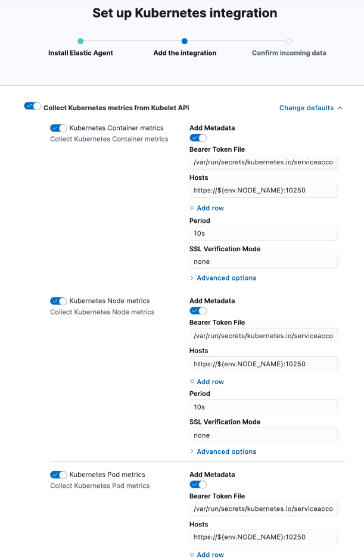

The deployment is OK. Te two pods names "elstic-agent-*" are visible in the cluster pods list in the AWS console.
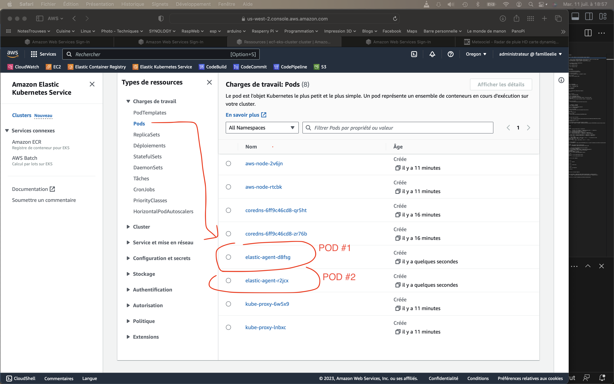

So, the step ONE of integration is complete. We need now to explore metrics and logs in the Kibana interface.
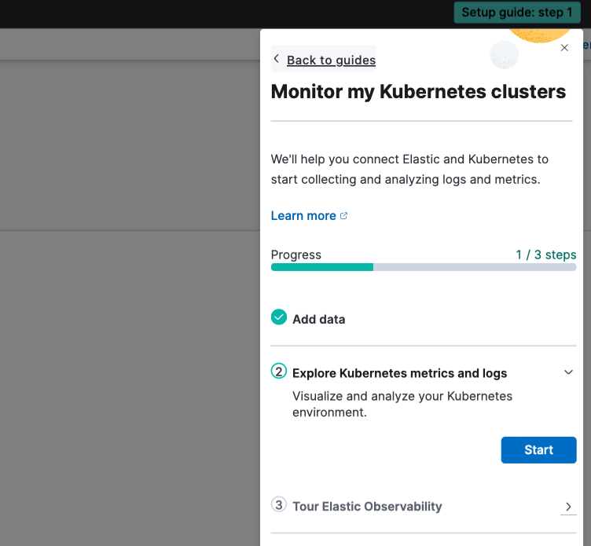

Take a tour of various pre-configured <b>metrics</b> and <b>dashbords</b> relative to the cluster.
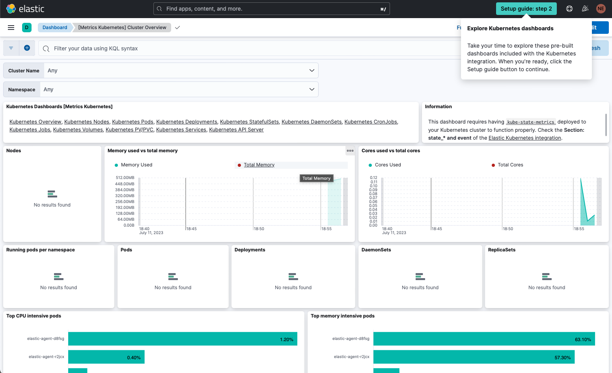
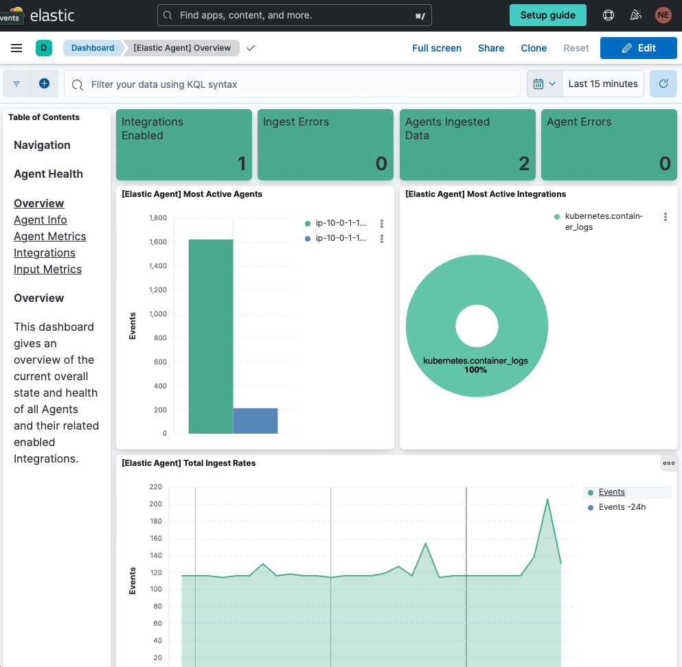
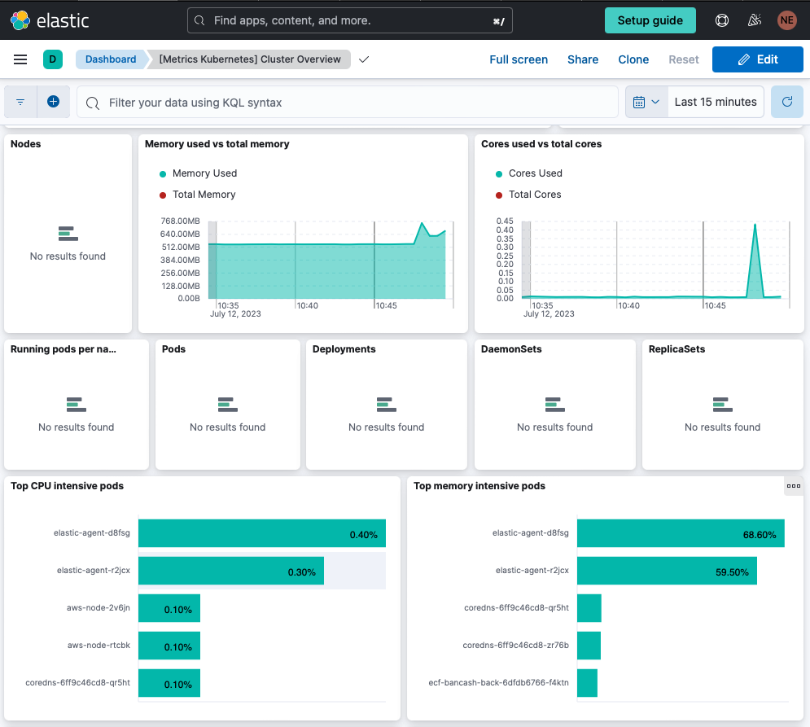

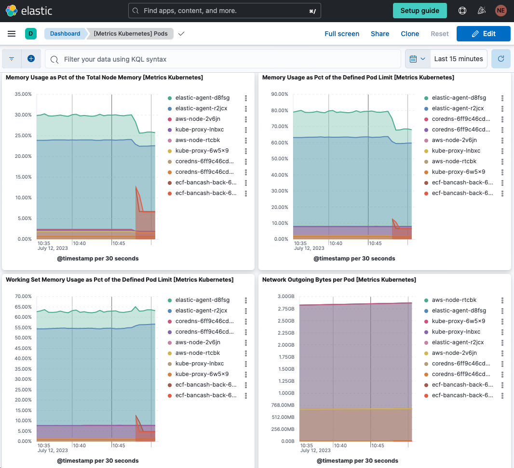


Steps are OK, wee seen various logs and metrics about eh cluster.
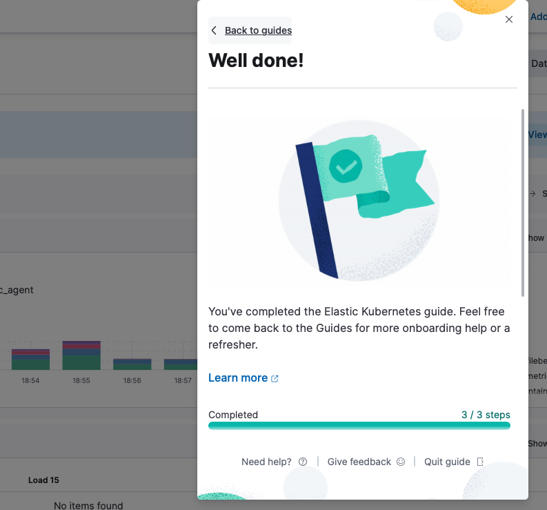

<br>

## TASK 2-2 : Setup Kibana to exploit data from custom application via the ElasticSearch API.

1. Data from a demo dockerized NODEJS app.

I wrot a simple demo app who send some temporal datas to my ElasticSearch deployment each time à refresh the page. So i can now draw a usage graph of the app.

<br>

Build docker image tagged with my DOCKER HUB account.

```
% docker build -t themaire/nodejs_2_elastic:latest -f dockerfile .
```
And I pushed it on DOCKER HUB.

```
% docker push themaire/nodejs_2_elastic:latest            
The push refers to repository [docker.io/themaire/nodejs_2_elastic]
1350b6812bb5: Pushed 
7db0b2c82717: Pushed 
375ec72b8601: Pushed 
3d43c1e0b5ff: Pushed 
a58f36acafc2: Pushed 
29420cec4282: Pushed 
6e510b7e8c2e: Pushed 
ef90ba9637e5: Mounted from library/node 
f551bcde2b16: Mounted from library/node 
a3170bd49e86: Mounted from library/node 
ad7578bb6cf2: Mounted from library/node 
9b9249a811e2: Mounted from library/node 
1a9054bc9c56: Mounted from library/node 
81639bbe8504: Mounted from library/node 
42f253cd68b4: Mounted from library/node 
latest: digest: sha256:fecd9430e62339ea66cb4811356695d549e9d5da60b39dc2c3bc239095067062 size: 3463
```
<br><br>

# Deployment
<p>Works only when our AWS EKS Kubernetes cluster is up (see how : https://github.com/themaire/ecf_eks_terraform/). We can now deploy the app on the cluster.</p>

Now, it is time to apply the Terrafom main.tf file for the deployment. The secrets must be stored in separeted text files like this, one environment variable by text file:

```
# SECRETS WILL BE SENT TO KUBERNETES
# VIA A KUBECTL COMMANDE VIA TERRAFORM

% mkdir ./secrets \
echo -n 'hello_prof3ssor!' > ./secrets/CLOUDID.txt \ 
echo -n 'noob_work_hard' > ./secrets/USERNAME.txt \
echo -n 'Devops_is_cool' > ./secrets/PASSWORD.txt

terraform init
terraform plan # For prevew what will do
terraform apply
```


<br><br>
In the app, the full test date and the timestamp of the refreshed page is shown.

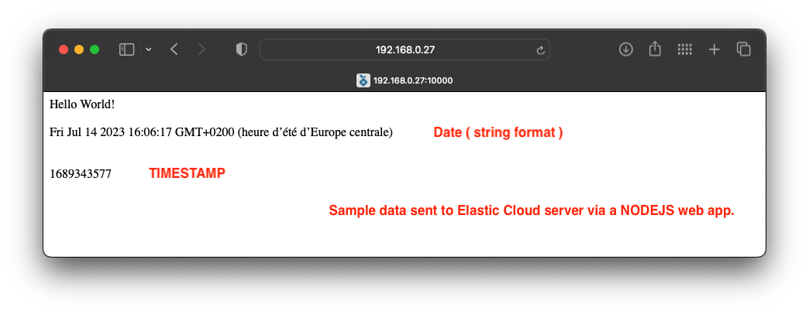

To show a integration via the API, i followed a exemple from https://www.elastic.co/guide/en/cloud/current/ec-getting-started-node-js.html to be able to send data to a index.

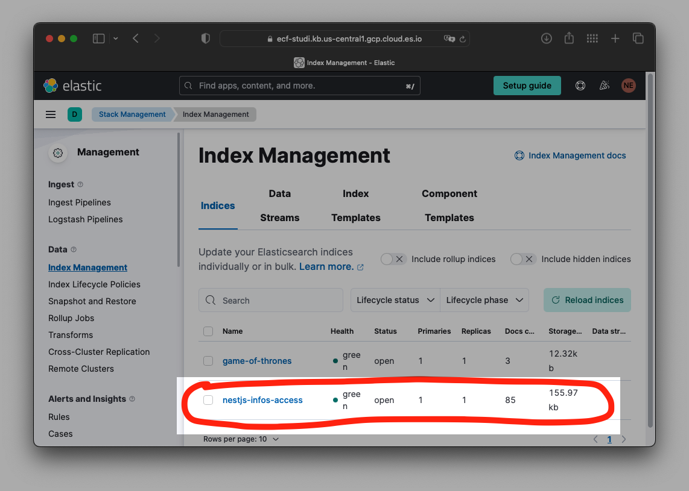

Queries can be defined into a index. It is called a view.
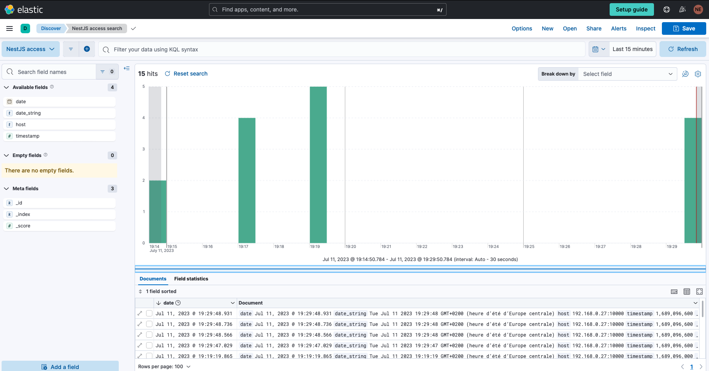

A view can be saved as a part of a custom created dashboard. This dashboard is composed by three lenses (graphs).<br>Donut for witch host served the app, and other for then the app vas accessed.
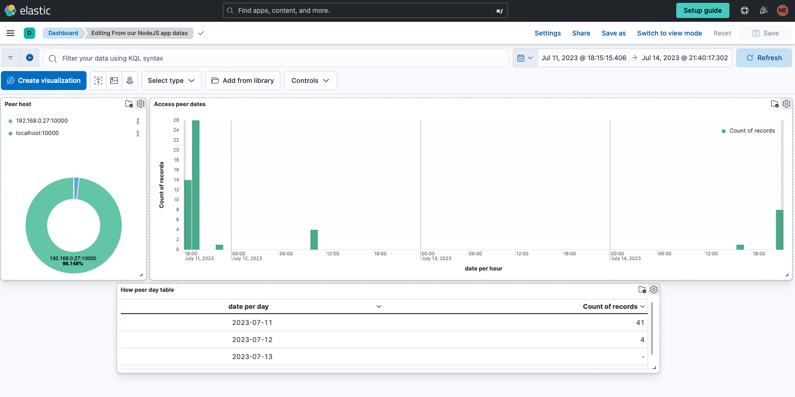
