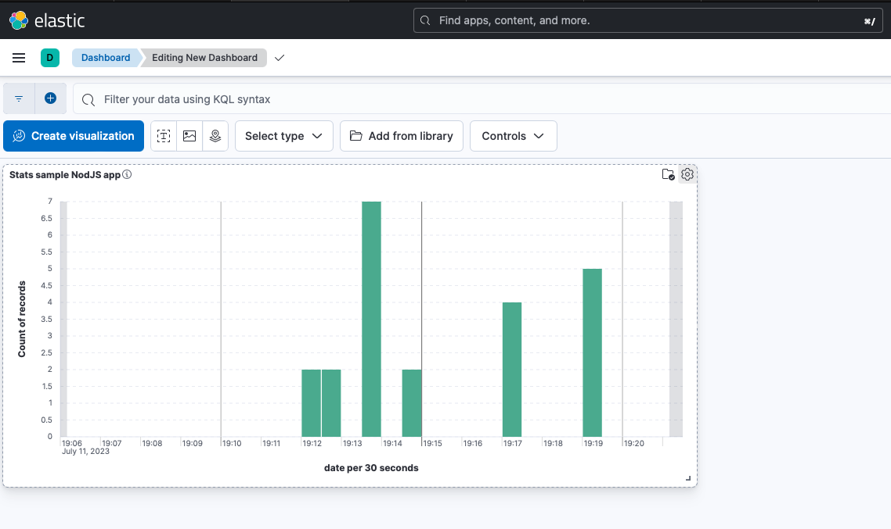

### Github repository : ecf_elastic_log.

# Activité Type 3 : Supervision des services déployés

Included tasks :
1. Mettez en place un ElasticSearch et connectez-le au Kubernetes.
2. Mettez en place un kibana et connectez-le au élasticsearch. Montrez des exemples de recherches sur les logs (kibana queries).

## Introduction :

Works only when our AWS EKS Kubernetes cluster is up (see how : https://github.com/themaire/ecf_eks_terraform/).

In DevOps practice, monitoring what is happening on our infrastructure is critical. For that, the couple of tools ElasticSearch (database) and Kibana (dashbord) will help us a lot to keep a eye on our Kubernetes cluster and a demo NodeJS app (for exemple).

### What I done :

## TASK 1-2 : Monitior a Kubernetes Cluster with ElasticSearch and Kibana

I created a account on https://cloud.elastic.co (paid service but 14 days trial account). Then, i created a "deployment", it is a kind of server. 
My "ECF_STUDI" is ready to store and serve datas.

Once entered in the deployment, i spotted a invitation to monitor a Kubernetes Server. Lucky i am, great help given here.

The first thing to do is to inatall the Kubernetes integration (plugin) on our ElasticSearch server.

My Kubernetes cluster is opérate and hosted by AWS, so i am able to apply the yaml format manifest file provided.  
It will deploy a POD who will send lot of cluster's logs. This is the <b>Elastic agent</b>.
  
Once deployed with the "kubectl apply -f ..." command, the page confirmed that Elastic agent is enrolled to ElasticSearch with success.

On the next page, we can choose witch data we want to be collected.

The deployment is OK. Te two pods names "elstic-agent-*" are visible in the cluster pods list in the AWS console.

So, the step ONE of integration is complete. We need now to explore metrics and logs in the Kibana interface.

Take a tour of various pre-configured <b>metrics</b> and <b>dashbords</b> relative to the cluster.

Steps are OK, wee seen various logs and metrics about eh cluster.

 

## TASK 2-2 : Setup Kibana to exploit data from custom application via the ElasticSearch API.

1. Data from a demo NODEJS app.

I wrot a simple demo app who send some temporal datas to my ElasticSearch deployment each time à refresh the page. So i can now draw a usage graph of the app.

  
In the app, the full test date and the timestamp of the refreshed page is shown.

To show a integration via the API, i followed a exemple from https://www.elastic.co/guide/en/cloud/current/ec-getting-started-node-js.html to be able to send data to a index.

Queries can be defined into a index. It is called a view.

A view can be saved as a part of a custom created dashboard.
